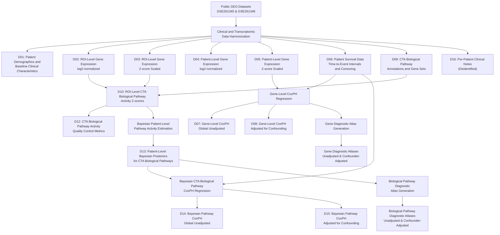

# SCAPeSCLC

**SCAPeSCLC** is a harmonized multi-level transcriptomic and clinical resource derived from the publicly available GEO datasets **GSE261345** and **GSE261348**, originating from the CANTABRICO and IMfirst cohorts of patients with extensive-stage small cell lung cancer (ES-SCLC).


This repository contains the R scripts and supporting datasets used to generate Bayesian pathway posterior estimates, perform gene- and pathway-level survival analyses, assess Cox proportional hazards model assumptions, and generate comprehensive diagnostic atlases for both gene expression and biological pathway activity.

The repository accompanies **SCAPeSCLC v1.3.5**, the published dataset and associated data paper.

---

## Current Release (v1.3.5)

Major additions include:

- Gene-level diagnostic atlases (unadjusted and confounder-adjusted)
- Biological pathway diagnostic atlases (unadjusted and confounder-adjusted)
- Proportional hazards assumption testing for all gene and pathway Cox models
- Bayesian estimation of patient-level Cancer Transcriptome Atlas pathway activities
- Complete SCAPeSCLC dataset provided in CSV and consolidated XLSX formats

---

## Associated Resources

- **Zenodo dataset (archival repository):** https://doi.org/10.5281/zenodo.19897644
- **Data paper:**  
  Shirvaliloo M. SCAPeSCLC: An Integrated Spatial Transcriptomic and Bayesian Pathway Enrichment Dataset for Survival Modeling in Extensive-Stage Small Cell Lung Cancer. *Data*. 2026;11(7):152. https://doi.org/10.3390/data11070152

---

# Repository Structure

```text
SCAPeSCLC
├── data/
│   ├── D5_scaled_gene_expression.csv
│   ├── D10_ROI_CTA_Zscores.csv
│   └── D13_patient_BP_posteriors.csv
│
├── dataset/
│   ├── csv/
│   │   ├── D01_patient_demographics_and_baseline_clinical_characteristics.csv
│   │   ├── D02_ROI_level_gene_expression_log2_normalized.csv
│   │   ├── D03_ROI_level_gene_expression_Z_scores_scaled.csv
│   │   ├── D04_patient_level_gene_expression_log2_normalized.csv
│   │   ├── D05_patient_level_gene_expression_Z_scores_scaled.csv
│   │   ├── D06_patient_survival_data_time_to_event_intervals_and_censoring.csv
│   │   ├── D07_gene_level_CoxPH_global_unadjusted.csv
│   │   ├── D08_gene_level_CoxPH_adjusted_for_confounding.csv
│   │   ├── D09_CTA_biological_pathway_annotations_and_gene_sets.csv
│   │   ├── D10_ROI_level_CTA_biological_pathway_activity_Z_scores.csv
│   │   ├── D11_patient_level_CTA_biological_pathway_activity_Z_scores.csv
│   │   ├── D12_CTA_biological_pathway_activity_quality_control_metrics.csv
│   │   ├── D13_patient_level_Bayesian_posteriors_for_CTA_biological_pathways.csv
│   │   ├── D14_Bayesian_CTA_biological_pathways_CoxPH_global_unadjusted.csv
│   │   ├── D15_Bayesian_CTA_biological_pathways_CoxPH_adjusted_for_confounding.csv
│   │   └── D16_per_patient_clinical_notes_deidentified.csv
│   │
│   └── SCAPeSCLC.xlsx
│
├── figures/
│   └── SCAPeSCLC_pipeline.png
│
└── scripts/
    ├── 01_gene_level_cox_models.R
    ├── 01_gene_level_cox_ph_assumptions.R
    ├── 02_bayesian_patient_level_pathways.R
    ├── 03_pathway_posterior_cox_models.R
    ├── 03_pathway_posterior_cox_ph_assumptions.R
    ├── 04_SCAPeSCLC_diagnostic_atlas_generator_for_genes.R
    ├── 04_SCAPeSCLC_diagnostic_atlas_generator_for_genes_confounder_adjusted.R
    ├── 05_SCAPeSCLC_diagnostic_atlas_generator_for_BPs.R
    └── 05_SCAPeSCLC_diagnostic_atlas_generator_for_BPs_confounder_adjusted.R
```
---

### Analysis Input Files

The `data/` directory contains the three analysis-ready data files directly used as inputs by the R scripts in this repository.

| File | Description |
| ------------------------------------ | ----------------------------------------------------------------- |
| **D5_scaled_gene_expression.csv** | Patient-level standardized gene expression matrix. |
| **D10_ROI_CTA_Zscores.csv** | ROI-level Cancer Transcriptome Atlas pathway enrichment Z-scores. |
| **D13_patient_BP_posteriors.csv** | Patient-level Bayesian posterior pathway activity estimates. |

### Complete SCAPeSCLC Dataset

The `dataset/` directory contains the complete SCAPeSCLC dataset in two formats:

- **CSV format:** The `dataset/csv/` directory contains the 16 individual data tables comprising the complete dataset.
- **Excel format:** `dataset/SCAPeSCLC.xlsx` provides the complete dataset in a consolidated workbook.
---

## Analysis Workflow

The repository implements the following analytical workflow:

1. Bayesian estimation of patient-level pathway activities from ROI-level Cancer Transcriptome Atlas pathway enrichment scores.
2. Gene-level Cox proportional hazards regression for progression-free, disease-specific, and overall survival.
3. Pathway-level Cox proportional hazards regression using Bayesian posterior pathway activity estimates.
4. Assessment of proportional hazards assumptions using Schoenfeld residuals for both gene- and pathway-level Cox regression models.
5. Generation of comprehensive diagnostic atlases for both genes and biological pathways, including:
   - model summary statistics,
   - hazard ratios and 95% confidence intervals,
   - Wald test statistics,
   - proportional hazards test results,
   - Martingale residuals,
   - Schoenfeld residuals,
   - Deviance residuals,
   - DFBETA influence diagnostics.
6. Generation of both unadjusted and confounder-adjusted diagnostic atlases for all survival endpoints (OS, DSS, and PFS).

---

## Data Provenance and Analytical Workflow

The diagram below summarizes the provenance of the major data products included in SCAPeSCLC and their relationships to the analytical pipelines implemented in this repository.

---

## Requirements

R **4.2** or later is recommended.

Required packages:

```r
install.packages(c(
  "dplyr",
  "survival",
  "broom",
  "purrr",
  "brms",
  "tidyr",
  "stringr",
  "ggplot2",
  "patchwork",
  "cowplot",
  "gtable"
))
```

---

## Citation

If you use **SCAPeSCLC** in your work, please cite the Zenodo dataset and the accompanying data paper. The GitHub repository provides the analysis code and an accessible copy of the complete dataset.

---

## License

This project is distributed under the **MIT License**.
